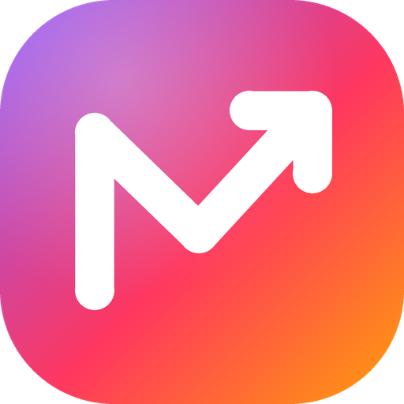

# Morro — Trading Dashboard

Morro is a personal portfolio and trading dashboard that runs entirely in your browser. No account, no server, no install: open the website and start tracking your trades. All data stays on your device.

**Free to use** – no account, no ads. Not open source: see [License](#license).

**English · Deutsch** (switch in the app) · **€ / $ / CHF / £** · **Tax rules for Germany, Austria and Switzerland** (or none)

> **Live demo:** [morrototy.github.io/morro/#demo](https://morrototy.github.io/morro/#demo) – explore the dashboard with sample data. Your own data is not touched.

---

## Features

- **My dashboard** – build your own start page from tiles of every section: net worth, history, top positions, allocation, recent activity, goals, journal today, trading stats, open leveraged trades, paper trading, events, trading hours, market sentiment, scanner setups, alerts, taxes and a free note. Tap *Edit* to add or remove tiles, drag them by the handle to another spot and pull the bottom-right corner to make them bigger or smaller (1–4 columns, 1–3 rows). Works with mouse and touch; the layout is saved in your browser.
- **Charts** – live candles straight from Bybit (every trade, via WebSocket; Coinbase as fallback) from 1 minute to 1 week, with a favorites list (plus the coins the scanner currently flags), your own candle colors, grid and background (light beam that turns green or red with the market, your own image/GIF/video, or a plain color). Draw long/short boxes with entry, target and stop – profit, loss and reward-to-risk in % and $ – and horizontal lines; everything is saved. Open journal trades appear as boxes automatically. Charting by TradingView Lightweight Charts™.
- **Overview** – net worth, profit, cash, next goal and a history chart. Switch between amounts and time-weighted return (%), optionally compared with the S&P 500.
- **Portfolio** – all positions with logos, weights and P/L. Tap a position for a live price, a chart (1 minute to 5 years), your thesis and exit plan, and the trades behind it.
- **Share images** – one tap on the gradient button in the header (or the card in *Portfolio*) creates a result card for any open or closed position, or a **collage** of up to 8 trades on one image, each with its own percentage (two designs, custom backgrounds, English/German, percent-only mode, “call by …” shoutout sticker). Every card carries Kerzi – leaning on the Morro name with sunglasses and a fan of cash (the classic logo if Kerzi is switched off) – and a QR code that leads to this repository.
- **Import trades** – the **+** button in the header (also at the top of the journal and in the *Data* tab) opens one place for all ways in: an exchange export (CSV), order screenshots or the form. No need to choose a destination: spot buys and sells go to the **portfolio** (optionally as existing holdings without touching your cash), leveraged trades (perps, margin, shorts) to the **trading journal** – a file can also be marked as all spot or all leverage. Closed spot trades can additionally be analysed in the journal (swing trades). Already imported trades are recognised and skipped.
- **One net worth** – every journal trade counts towards your portfolio automatically: leveraged trades appear as positions such as “BTC Long · Leverage” with margin, open profit/loss at the latest price (Coinbase, then Bybit or Kraken, or entered by hand), entry and approximate liquidation price; closed ones as realised gains (taxed like derivatives, not like spot crypto). Spot trades in the journal become real holdings with holding period. Amounts in USD are converted with the ECB rate of the trade day (via frankfurter.dev), and earlier days in the history chart are filled in as well. If only leveraged trades are recorded, a card asks once for your exchange balance so cash and net worth add up. Nothing is entered twice, and the backup export contains only your own entries.
- **Journal** – day-trading journal in USD with daily loss limit, pre-trade checklist, calendar, equity curve and weekly review. **CSV import:** drop the export from Kraken, Kraken Futures, OKX, Bybit, Binance, Bitget or any other exchange – partial fills are merged into trades, duplicates are skipped, and unknown formats can be mapped by hand. Kraken Futures ledgers (which contain no prices) are imported with exact result, fees and funding; the entry price is estimated from Kraken candles and can be overwritten.
- **Arcade** – the controller button in the header opens two mini games with real Kraken candles:
  - **Stop-loss ninja** – a real trade (long or short) plays out candle by candle; drag the orange stop line with mouse or finger (or ↑/↓) – only tighter, never wider. Get stopped out too early or give back profit: the result is counted in R (1 R = initial risk of 2× the typical range), with “best possible” shown after each trade. Five trades, ranks from “Target practice” to “Ninja master”.
- **Mini game “Long or short?”** – a real chart (random coin, timeframe and period, name hidden) stops at a point; guess whether the price is higher or lower 15 candles later, then the future is revealed. Arcade look with title screen, two modes (Classic, Blitz with 8 seconds and speed bonus), points with streak bonus, round indicator, animated reveal, ranks from “Unlucky” to “Oracle”, high score and overall hit rate. Opens with the controller button in the header (next to the eye); keys ↑/↓/Enter. A good reality check for gut feeling.
- **Paper trading** – test setups, scanner signals or calls with real prices and no real money (journal → *Paper*). Stop, target and liquidation are checked against the exchange's candles; results and hit rate per setup/source are tracked separately from your real trades.
- **Event warnings** – Fed decisions, US CPI and jobs reports and US elections are built in (shown in your local time); add your own events such as an announced Trump speech. Upcoming events show up as warnings in the journal and the scanner.
- **Scanner** – setup scanner for the exchange and pair you trade (Kraken margin in EUR/USD/USDC, Bybit and Bitget USDT/USDC perps, OKX USDT perps). It analyses daily and 4-hour candles (20/50/200-day trend, RSI, volatility squeeze, 20-day high/low, volume, strength vs BTC) and sorts setups by stage: **early** (tight range just before a breakout, entered with a buy stop), **confirmed** (breakout with volume, retest), **in trend** (pullback) and **late** (overextended – warning only), mirrored for shorts. Every setup shows a ✓/✗ checklist, a plan based on structure (trigger, stop, target, reward-to-risk) and a risk score for 3x/5x/10x.
- **Market sentiment** – share of accounts that are long (Bybit/Bitget) per setup with a warning when it gets crowded, plus BTC dominance and an altcoin season index (how many of the top 50 coins beat BTC over 30 days).
- **Partial sales** – plan take profit 1 and 2 with a share (e.g. 50 % at TP 1), close trades in parts in the journal, and let paper trades sell 50 % at TP 1 and move the stop to break-even automatically.
- **Trade from screenshots** – drop or paste order screenshots from your exchange app into the journal; text recognition (runs in your browser) reads side, amount, price and time, merges partial fills and fills in the form for you to check.
- **Signal diary** – every scan logs its setups and checks after up to 72 hours whether the target or the stop was hit first, so you see the real hit rate per setup type without trading.
- **Alerts and trading hours** – price alerts with browser notifications (while the dashboard is open) plus a list to copy into your exchange or TradingView; Asia/Europe/US sessions in your local time with overlap, weekend note and typical BTC volatility per hour.
- **Journal analysis** – expectancy, required win/loss ratio, holding time of winners vs losers, weekday × time heatmap, wins and losses grouped by multiples of your risk (big win, stop hit, lost more than planned …), results by stage, pair currency and mistake tags (FOMO, moved stop, …), and the price path during each trade (best/worst point vs your exit). Trades keep their pair currency (EUR, USD, USDT, USDC); totals are shown in $ or €. Shows funding (annualised) and open interest for perps and flags expensive funding. Suggests stop, target and position size for your risk per trade and prepares the trade in the journal – or starts it as a paper trade – with one click. Filters, not predictions.
- **Plan** – what-if calculator, knock-out/turbo leverage calculator (long and short, any leverage), leverage plan with partial sale, wish portfolio and an ETF savings calculator.
- **Savings** – goal ring with milestones, monthly budget plan, long-term plan (bank account vs. portfolio) and “new money per month”.
- **Taxes** – depending on your country:
  - Germany: remaining annual allowance (Sparerpauschbetrag), crypto €1,000 exemption limit and 1-year holding period per purchase
  - Austria: estimated 27.5 % KESt after netting gains and losses, crypto bought before March 2021
  - Switzerland: check of the five ESTV criteria for “professional securities trading”
  - none: the tax tab is hidden
- **Data** – prices, deposits/withdrawals, goals, list of all trades and backup (export/import everything as a JSON file). Trades are added via the **+** button (exchange export, screenshots or by hand).
- **Guided start** – with your own data, Kerzi walks you through it: cash balance → import trades (exchange export, screenshots or by hand) → current prices → done.
- **Kerzi** – a little candlestick mascot that guides you through the tour and reacts to your trading day in the journal (green, red, celebrating). Can be switched off in Settings.
- **First visit** – a short tour starts with the sample portfolio; right after the welcome you pick your look from three live previews (Morro, Terminal, Clean in black or white) – the page behind switches instantly.
- **Settings** – language, currency, tax country, optional password, sounds, restart the tour, and the **background**: presets Rainbow, Blue & white, Sunset, Northern lights, Purple, Single colour (any colour) or Off, with brightness and motion. Make it fully yours: colour themes (Morro, Ocean, Forest, Sunset, Neon, Monochrome, and **Terminal** – a trading-terminal look in amber on black with monospace font, panel title bars, a ticker band of your own positions and a command line: type `PORT`, `JRNL`, `SCAN`, `DASH`, `SET`, `GAME` or `HELP` and press Enter, or press `/` to jump into it), and **Clean / Clean Dark** – a calm, minimal look in black and white where only gains and losses keep their green and red, with a large portfolio value, one simple performance line and timeframe buttons on the Portfolio page) or your own gradient and button colours, tile opacity, glass blur and corner radius, plus your **own background image** (darken, blur, light beam on top or off) – stored only in your browser.
- **Live prices** – crypto without any key (Coinbase, Bybit as fallback; works in €, $, CHF and £). Stocks with a free [Finnhub](https://finnhub.io) API key that you enter yourself.
- **Lock screen** – optional password (stored only as a hash). This is a privacy screen, not encryption.

## Quick start

1. Open [morrototy.github.io/morro](https://morrototy.github.io/morro/) in a current browser (Chrome, Edge, Firefox, Safari) – or download `index.html` and open it locally for your own use.
2. On your first visit Morro opens with a **sample portfolio** and a **tour** of about three minutes (overview, portfolio, plan & savings, journal with analysis and paper trading, scanner, share images, import, settings and – last – how to build your own dashboard). Afterwards you either keep exploring the sample or choose **Add my own trades**: the sample data is removed, you pick language and country (sets currency and tax rules) and an optional password, and the import opens. You can restart the tour from the bar at the bottom while the sample is shown; everything else can be changed later in the **Data** tab.

Every visitor gets their own, empty dashboard: the data is stored in their browser, not on GitHub.

### Link options

You can add options to the address after `#`, separated by `&`:

| Option | Example | Effect |
|---|---|---|
| `demo` | `index.html#demo` | sample portfolio, kept in memory only |
| `lang` | `#lang=en` | `en` or `de` |
| `cur` | `#cur=USD` | `EUR`, `USD`, `CHF`, `GBP` |
| `tax` | `#tax=none` | `DE`, `AT`, `CH`, `none` |
| `view` | `#view=planen` | `dashboard`, `uebersicht`, `portfolio`, `planen`, `sparen`, `journal`, `scanner`, `steuer`, `daten`, `einstellungen` |

Example: `index.html#demo&lang=en&cur=USD&tax=none`

## Your data and privacy

- Everything you enter is saved in your browser's local storage (`localStorage`) on your device. Nothing is sent to a server of this project – there is none.
- Clearing your browser data deletes the dashboard data. **Export a backup regularly** (Data → Backup).
- The app loads data from these external services (details: [privacy policy](datenschutz.html)):

| Service | Used for | Key needed |
|---|---|---|
| Coinbase, Bybit | live crypto prices and the exchange rate | no |
| CoinGecko | scanner market data (name, logo, market cap, 1h–30d change), BTC dominance, altcoin season, S&P 500 comparison (SPY token) | no |
| Binance, Coinbase | crypto charts | no |
| frankfurter.dev (ECB rates) | USD exchange rate on the day of each imported or journal trade | no |
| Bybit, OKX, Bitget, Kraken public APIs | scanner (markets with leverage, prices, daily candles) for the exchange you pick; Kraken candles also estimate the entry of imported Kraken Futures ledgers | no |
| Finnhub | live stock prices | yes, your own free key |
| TradingView widget | stock charts | no |
| Parqet, Financial Modeling Prep (via wsrv.nl for share images) | logos | no |

Only ticker symbols are sent to these services, never your holdings or amounts. Like any web request, they see your IP address. The website itself is hosted on GitHub Pages.

## Data format

The export (`Data → Export data`) is a JSON file. `example-data.json` shows the structure. The field names are German:

| Field | Meaning |
|---|---|
| `trades[]` | `datum` (date), `typ` (`Kauf` = buy / `Verkauf` = sell), `asset`, `ticker`, `klasse` (`Aktie` = stock, `ETF`, `Krypto` = crypto, `Derivat` = derivative), `stueck` (units), `kurs` (price), `gebuehr` (fee), `gesamt` (total incl. fee), `notiz` (note) |
| `kasse[]` | cash movements that are not trades: `datum`, `betrag` (amount, negative = withdrawal), `art` (type) |
| `kurse` | current price per asset |
| `snapshots[]` | daily values: `datum`, `wert` (portfolio value), `cash` |
| `derivate` | knock-out details per product: `basisTicker`, `richtung` (`long`/`short`), `schwelle` (barrier in USD), `bezug` (ratio), `hebelKauf` (leverage at purchase) |
| `milestones`, `monatsziel`, `spar` | goals and savings plan |

Realized profits use the average cost method. Prices and amounts are in the currency you chose in the settings.

## Translations

The interface is written in German; English comes from a built-in dictionary. Found a wrong or clumsy translation? Please [open an issue](https://github.com/MorroToty/morro/issues).

## Support

Morro is a free private project. If Morro helps you and you want to say thanks, you can [support it on GitHub Sponsors](https://github.com/sponsors/MorroToty) – completely optional.

## Disclaimer

Morro is a tool for recording, organising and calculating – not a broker and not financial, tax or legal advice. Prices can be delayed or wrong. Calculations (especially taxes and leveraged products) are simplified and can be wrong. Check important decisions with a professional.

## Privacy & security

- **There is no money in Morro.** It is not a broker – it only shows numbers for your overview. Your real money stays with your broker or exchange, and nobody can move, sell or withdraw it from here, even if they saw your data.
- **No account, no server, no tracking.** Everything you enter is stored only in your browser (localStorage) on this device. There is no database – nobody else, including the developer, can see your numbers.
- **No connection to your account.** Trades come in via files (CSV export, screenshots) or by hand. Morro never asks for login details or exchange API keys.
- **Files stay local.** CSV files and screenshots are read in the browser; nothing is uploaded.
- **What leaves your device:** price requests to public services (CoinGecko, exchange APIs, TradingView charts, frankfurter.dev for exchange rates, Finnhub if you add your own key) and logo images. These requests contain only which coins or stocks to look up – never amounts, quantities or balances. Like any website request, they reveal your IP address to those services.
- **Your device is the key.** Anyone with access to this browser profile can see the data. The optional password lock is a privacy screen, not encryption.
- **Back up.** Clearing browser data deletes your Morro data too – export a backup under Data → Backup.

In the app: footer → “Security & data”, or the lock button in the tour.

## License

© 2026 MorroToty. All rights reserved – see [LICENSE](LICENSE).

- **Allowed:** using Morro for free, privately and for your own trading; keeping copies for yourself as a backup.
- **Not allowed without permission:** copying or publishing the code or the app elsewhere, publishing modified versions, selling it or building your own product on it, removing the name or logo.
- No investment, tax or legal advice; provided as is.

Third-party components (Chart.js, TradingView Lightweight Charts, Tesseract.js) keep their own licenses – see [THIRD-PARTY-NOTICES.md](THIRD-PARTY-NOTICES.md).

**Deutsch:** Kostenlos nutzbar, privat und für deine eigenen Trades. Kopieren, Weiterverbreiten, veränderte Versionen veröffentlichen und Verkaufen sind ohne Erlaubnis nicht gestattet. Keine Anlage-, Steuer- oder Rechtsberatung.

## Privacy policy

- [Datenschutzerklärung (privacy policy)](datenschutz.html)

## Deutsch

Morro ist ein persönliches Depot- und Trading-Dashboard, das komplett im Browser läuft: kein Konto, kein Server, nichts installieren. Website öffnen und loslegen. Alle Daten bleiben auf deinem Gerät. **Kostenlos.**

- **Ausprobieren:** `index.html#demo` öffnet ein Beispieldepot, deine eigenen Daten bleiben unberührt.
- **Erster Start:** Morro öffnet mit einem **Musterdepot** und einer **Tour** von etwa drei Minuten. Danach entweder weiter umsehen oder „Eigene Trades erfassen“: Musterdaten weg, Sprache und Land wählen, optional Passwort, dann öffnet sich der Import. Ändern lässt sich alles später unter **Einstellungen** – dort auch der Hintergrund (Regenbogen, Blau-Weiß, Sonnenuntergang, Nordlicht, Lila, Einfarbig oder Aus).
- **Mein Dashboard:** eigene Startseite aus Kacheln aller Bereiche – unter „Bearbeiten“ hinzufügen, am Griff verschieben, an der Ecke größer oder kleiner ziehen.
- **Bilder zum Teilen:** Der Verlaufs-Knopf oben rechts oder die Karte im Tab *Portfolio* öffnet die Auswahl der Position.
- **Trades importieren:** Der **+**-Knopf oben (auch oben im Journal und im Tab *Daten*) öffnet Börsen-Export (CSV), Screenshots oder das Formular. Spot-Käufe landen automatisch im Depot, Hebel-Trades (Perps, Margin, Shorts) im Journal. Bereits importierte Trades werden erkannt.
- **Ein Vermögen:** Jeder Journal-Trade zählt automatisch im Depot mit – Hebel-Trades als Position „<Coin> Long/Short · Hebel“ mit Margin und offenem Gewinn/Verlust, geschlossene als realisierter Gewinn.
- **Journal + CSV-Import:** Export deiner Börse (Kraken, Kraken Futures, OKX, Bybit, Binance …) ins Journal ziehen – Teil-Ausführungen werden zusammengefasst, Duplikate übersprungen.
- **Scanner:** Altcoins mit Hebel an deiner Börse (Bybit, OKX, Bitget oder Kraken), sortiert nach Risiko für deinen Einsatz, mit Stop, Ziel und Positionsgröße. Filter, keine Vorhersage.
- **Live-Kurse:** Krypto läuft ohne Schlüssel. Für Aktien einen kostenlosen Schlüssel bei [finnhub.io](https://finnhub.io) holen und im Live-Fenster eintragen.
- **Sicherung:** Die Daten liegen im Browser-Speicher. Regelmäßig unter *Daten → Sicherung* exportieren.
- **Steuern:** Deutschland, Österreich, Schweiz oder aus. Grobe Orientierung, keine Steuerberatung.
- **Rechtliches:** [Datenschutzerklärung](datenschutz.html) · [Lizenz](LICENSE)
